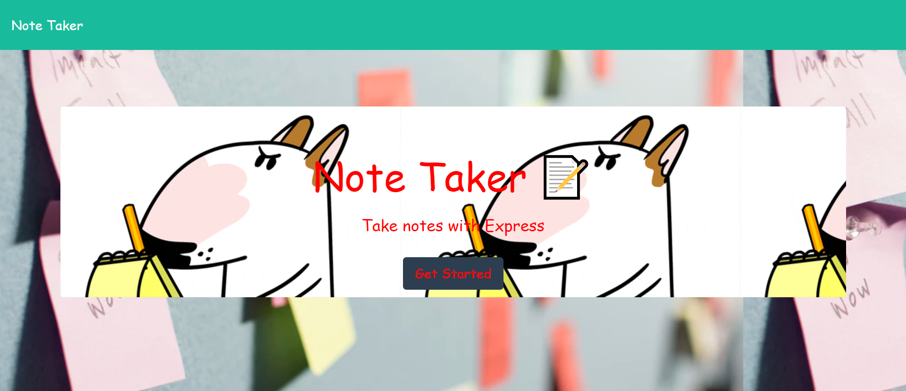
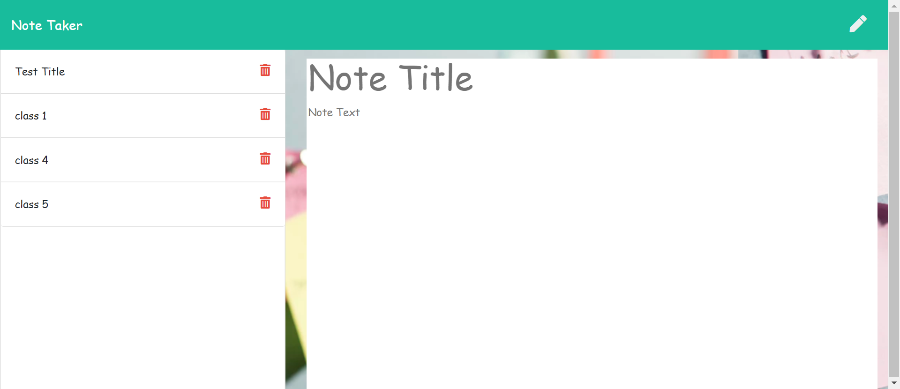
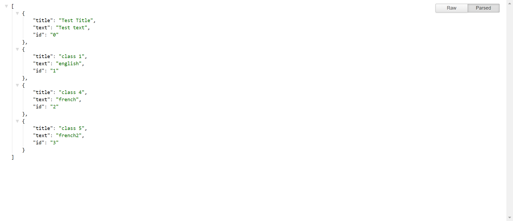

# NotesTaker_DR


For this project, I have created an application that can be used to write, save, and delete notes, written to and retrieved from a backend JSON file created by me.

## Table of Contents
* [Introduction](#introduction)
* [Screenshots of the App](#scr)
* [Demo of the Application](#demo)
* [Deployed Application](#web)
* [Installations](#installations)
* [Questions](#ques)
* [Credits](#credits)

 ## Introduction 
 For this project the frontend was already provided,but I added some styling to it without changing the javascript part of it.Along with it, I built the backend part of the App and connected the two together.I created the routes, namely,__apiRoutes.js__  where the get post and delete functions are created and implemented.Also, the __htmlRoutes.js__ which routes the file to the correct files.At the end, the __server.js__ file is used to set up the port and list it as a localhost.All the notes are returned and saved as JSON.


 ## Screenshot of the App
 
 __Landing Page__
 
 
 __Notes Page__
  
  
  __API's__
  
 
 ## Demo of the App
 

 ## Deployed Application
 The following shows how I created this app and how it generates the file. I may make some chagnges to the code to make it more clean. But more or less, it is almost an exact representation of the code

 [](https://notetakerdr.herokuapp.com/)
 
 Else we can also run the app from the terminal by using running 
 
 ```
node server.js
```
And then search for the localhost:2020 in your browser
 

 
 ## Installations
   * [The URL of the Github repo](https://github.com/Dipti2021/NotesTaker_DR)
   

 ## Questions
In case of any questions, contact me through any of the following methods:
 * If you want you can [open an issue](https://github.com/Dipti2021/NotesTaker_DR/issues) and let me know about it.
 * You can contact me on [my  mail id](mailto:dipti.raina@gmail.com) and discuss the problems that you might have faced or even if you want to add on something to the code.


    
 ## Credits
    The homework has been assigned to me by the Carleton University Coding Bootcamp, our instructor and the TA's
